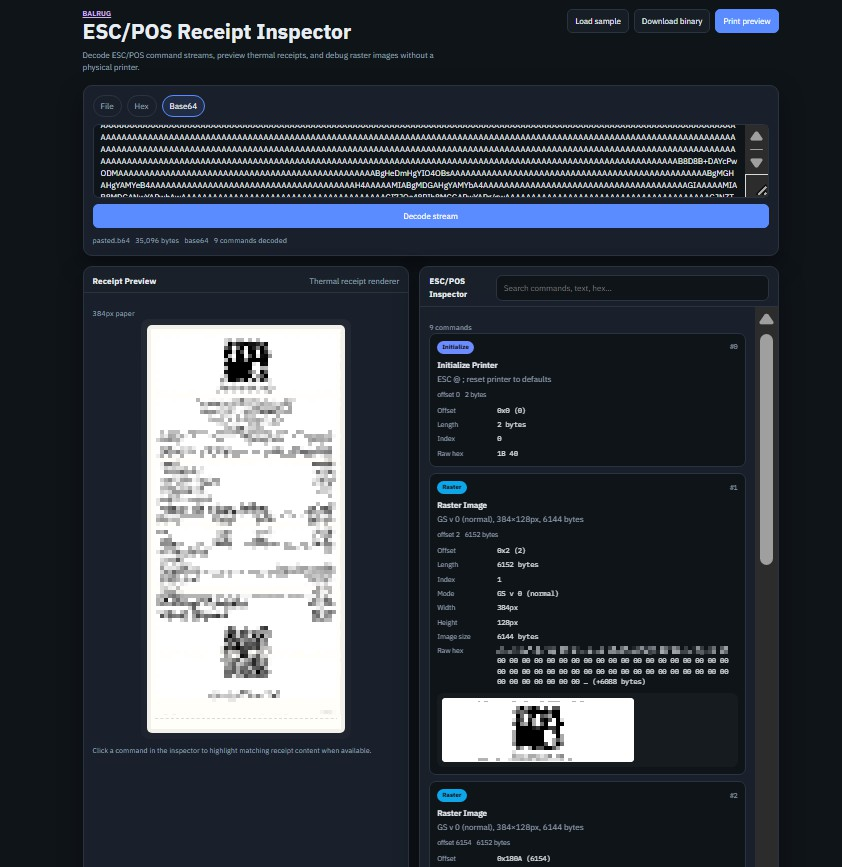

# ESC/POS Receipt Inspector



**EscPosInspector** is a browser-based **ESC/POS debugger**, **receipt preview** tool, and **thermal printer emulator** for developers building point-of-sale (POS) applications, payment integrations, kiosk software, and backend receipt generators.

Instead of wasting paper or squinting at hex dumps, you can load a binary ESC/POS stream and instantly see:

- a **thermal receipt preview** that approximates printer output
- a decoded **ESC/POS command list** with offsets, lengths, and raw bytes
- image and **raster image debugging** with width, height, payload size, and inline previews
- click-to-highlight navigation between commands and rendered receipt content

If you are searching for an **ESC/POS viewer**, **ESC/POS parser**, **ESC/POS binary viewer**, or **receipt testing** utility, this project is designed to be a practical daily tool for POS printer development.

## Why use EscPosInspector?

Thermal receipt development is painful when your feedback loop is:

1. generate bytes in your app
2. send them to a physical printer
3. guess which command caused the misaligned logo, clipped barcode, or blank QR code

EscPosInspector shortens that loop. Load `.bin`, `.escpos`, `.prn`, pasted **hex**, or **Base64 ESC/POS** data and inspect the exact command sequence your software produced.

> This project filled a gap I kept running into during my own testing and helped me a lot. I searched for the same kind of app for a long time and failed to find such an emulator, so I built it. I hope it helps other developers too.

### Typical debugging scenarios

- **Receipt layout issues** ; verify alignment, line feeds, bold state, and font size commands before shipping to production.
- **Raster image debugging** ; confirm width/height headers, payload length, and decoded bitmap previews for logos and signatures.
- **QR code printing** ; inspect QR setup commands (`GS ( k`) and confirm stored payload data.
- **Barcode printing** ; validate symbology selection and encoded data for CODE128, EAN, UPC, and related formats.
- **API integration testing** ; paste Base64 ESC/POS returned by a cloud print API and confirm the decoded stream.
- **Regression checks** ; compare command offsets and raw hex between builds when receipt output changes unexpectedly.

### Problems this tool helps solve

- Mystery bytes in the middle of a print job
- Truncated image payloads
- Missing cut or feed commands
- Unexpected printer initialization resetting styles
- Encoding mismatches in text sections
- Difficulty reproducing customer receipt issues without hardware

## Features

- **Receipt preview** ; render a thermal-style receipt from ESC/POS binary data
- **ESC/POS inspector** ; human-readable command decoding with stream offsets
- **Click-to-highlight** ; select a command to highlight matching preview content when possible
- **Raster/image analysis** ; show command type, dimensions, payload size, stream position, and image preview
- **Hex/Base64 input** ; debug API payloads without creating files
- **Unsupported command visibility** ; undecoded bytes are shown as hex instead of being silently dropped
- **Print preview** ; open a printer-friendly preview window
- **Sample receipt** ; built-in demo stream for exploring the UI
- **Modular architecture** ; parser, renderer, inspector, preview, file loader, and print service are separated for easy extension

## Quick start

### Requirements

- Node.js 18+
- npm 9+

### Install and run

```bash
npm install
npm run dev
```

Open the local development URL shown in your terminal.

### Build for production

```bash
npm run build
npm run preview
```

## Usage

### Load a binary ESC/POS file

Use the **File** tab to load `.bin`, `.escpos`, `.prn`, or text-encoded ESC/POS files.

### Paste hex or Base64

Use the **Hex** or **Base64** tabs when debugging:

- logs from a print proxy
- REST responses that return Base64 ESC/POS
- copied output from an ESC/POS binary viewer

### Inspect commands

The inspector panel shows decoded commands such as:

- Initialize Printer
- Text
- Alignment
- Font Size / Print Mode
- Line Feed / Feed
- Bit Image / Raster Image
- QR Code
- Barcode
- Cut
- Unsupported commands with raw hex

Click a command to highlight the corresponding preview region when a visual mapping exists.

## Supported commands

EscPosInspector currently decodes many common ESC/POS commands used in receipt printing:

| Category        | Commands                                   |
| --------------- | ------------------------------------------ |
| Printer control | `ESC @` initialize                         |
| Text            | printable text runs                        |
| Layout          | `ESC a` alignment                          |
| Typography      | `ESC !`, `GS !`, `ESC E`, `ESC -`          |
| Paper feed      | `LF`, `CR`, `ESC d`, `ESC J`               |
| Cut             | `GS V`                                     |
| Legacy image    | `ESC *` bit image                          |
| Raster image    | `GS v 0`, `GS ( L` graphics store          |
| QR code         | `GS ( k` store/size/error correction/print |
| Barcode         | `GS k` CODE128 and common symbologies      |

Command support is intentionally modular. New command handlers can be added in the parser without rewriting the UI.

## Unsupported commands

Unknown or partial commands are reported explicitly:

- command label set to **Unsupported**
- reason/description when parsing fails mid-command
- **raw hexadecimal bytes** for the exact span consumed or detected

This makes EscPosInspector useful as an ESC/POS binary viewer even when full semantic decoding is not yet implemented.

## Architecture

The project is split into focused modules:

```text
src/
├── parser/          # ESC/POS stream decoder
├── renderer/        # Canvas receipt renderer
├── inspector/       # Command list UI and formatting
├── preview/         # Receipt preview panel
├── fileLoader/      # Binary, hex, and Base64 input loading
├── printService/    # Print and download helpers
└── types/           # Shared command and render types
```

Design goals:

- one responsibility per module
- easy addition of future ESC/POS commands
- shared typed command model across parser, renderer, and inspector

## Roadmap

- [ ] NV graphics / downloaded image commands
- [ ] Cash drawer kick decoding
- [ ] Code page and international character set support
- [ ] Column-wise text layout simulation
- [ ] Command diff between two ESC/POS files
- [ ] Export inspector report as JSON or Markdown
- [ ] CLI packaging for CI receipt regression tests
- [ ] Optional server-side rendering for large streams

## Contributing

Contributions are welcome.

1. Fork the repository
2. Create a feature branch
3. Add parser/renderer support with focused changes
4. Include sample input bytes when adding command support
5. Open a pull request describing the ESC/POS behavior and test stream

Please keep modules small and prefer extending the typed command model over adding special-case UI logic.

## License

MIT ; see [LICENSE](LICENSE).

Developed by [Amin Norollah](https://github.com/amin-norollah). Free to use ; attribution is not required, but crediting the author is appreciated.

---

Built for developers working on **POS printer development**, **receipt rendering**, and **ESC/POS generation** workflows.
